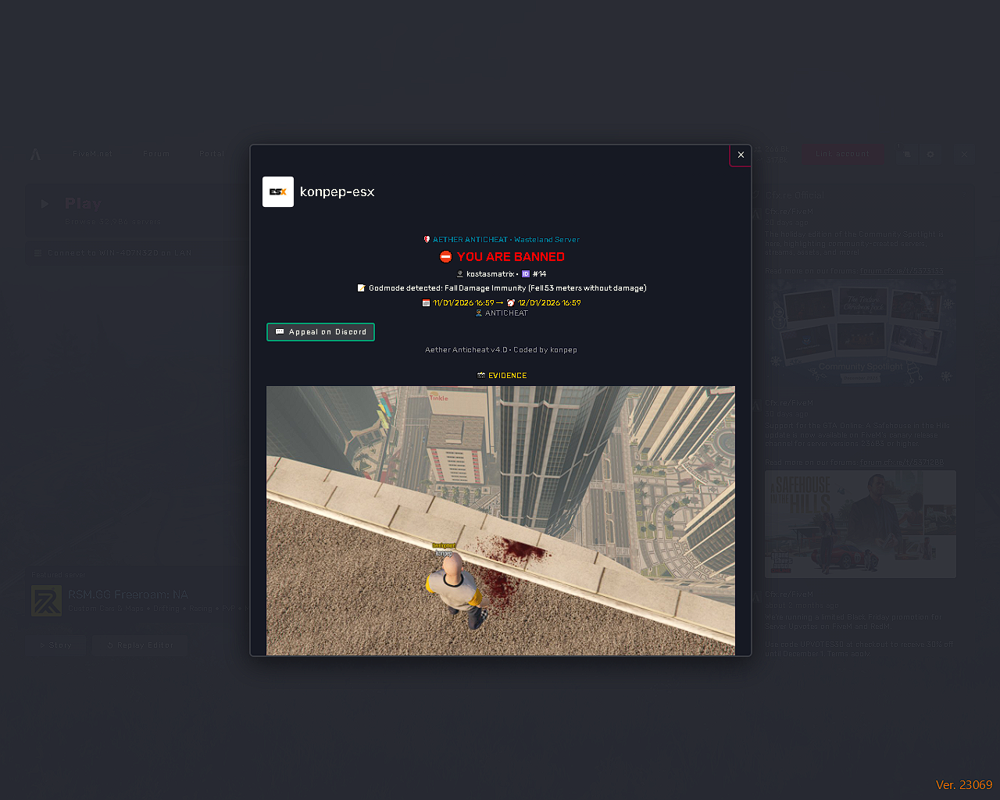
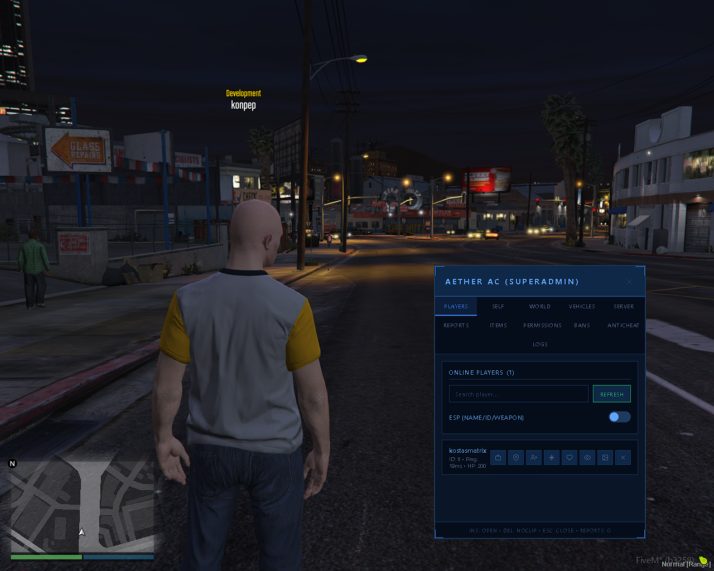
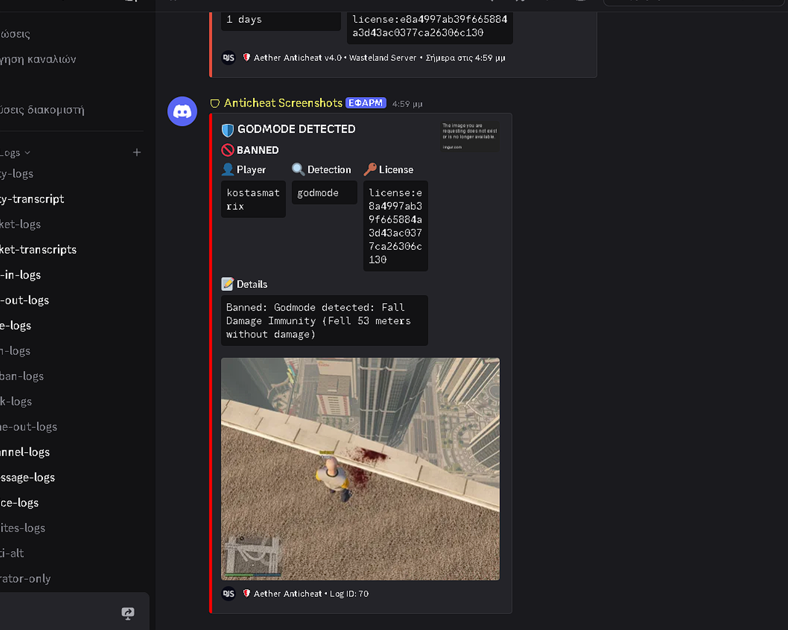

<div align="center">

# 🛡️ AETHER ANTICHEAT


### Advanced Protection System for FiveM

[](https://github.com)
[](https://fivem.net)
[](https://discord.gg/your-server)

<br/>


<br/>

**🔒 Protect your server from cheaters with advanced detection systems**

<br/>

[📖 Documentation](#-documentation) • [⚡ Quick Start](#-quick-start) • [📸 Screenshots](#-screenshots) • [🔌 Developer API](#-developer-api)

---

</div>

<br/>

## 📸 Screenshots

<div align="center">

### 🚫 Ban Card



<sub>Beautiful ban screen with screenshot evidence, ban details, and Discord appeal</sub>

<br/><br/>

### 👨‍💼 Admin Panel



<sub>Full-featured admin panel with player management, vehicles, and more</sub>

<br/><br/>

### 📢 Discord Logs



<sub>All bans logged to Discord with screenshot attachment</sub>

</div>

<br/>

---

<br/>

## 🌟 Why Aether?

<table>
<tr>
<td width="50%">

### 🎯 Accurate Detection
Advanced algorithms that detect cheaters while minimizing false positives. Ragdoll protection, spawn protection, and safezone support built-in.

</td>
<td width="50%">

### ⚡ Instant Response
Real-time detection with configurable instant bans. Screenshot evidence captured automatically before ban.

</td>
</tr>
<tr>
<td width="50%">

### 📸 Evidence System
Every ban includes a screenshot. Evidence is stored in database and sent to Discord automatically.

</td>
<td width="50%">

### 🎨 Beautiful Ban Card
Players see a professional ban screen with their screenshot, reason, and appeal information.

</td>
</tr>
</table>

<br/>

---

<br/>

## 🎮 Features

### 🛡️ Anticheat Detections

| Detection | Description | Configurable |
|-----------|-------------|:------------:|
| 🚀 **Anti-Noclip v3.0** | Wall passing, floating, flying detection | ✅ |
| 🛡️ **Anti-Godmode** | Invincibility, super health/armor | ✅ |
| ⚡ **Anti-Teleport** | Instant position changes | ✅ |
| 🎯 **Anti-Aimbot** | Silent aim, bone lock, aim snap | ✅ |
| 📹 **Anti-Freecam** | Camera manipulation | ✅ |
| 🚗 **Vehicle Blacklist** | Tanks, jets, oppressors | ✅ |
| 🔫 **Weapon Blacklist** | Railgun, alien weapons | ✅ |
| 💓 **Heartbeat System** | Disabled anticheat detection | ✅ |
| 📦 **Anti-Resource Stop** | Prevents stopping server resources | ✅ |

<br/>

### 👨‍💼 Admin Panel Features

| Feature | Description |
|---------|-------------|
| 🎮 **Player Management** | Kick, Ban, Freeze, Teleport, Bring, Spectate |
| 🚗 **Vehicle System** | Spawn, Delete, Repair with categories |
| 🔫 **Weapons** | Give weapons to players |
| 📦 **Inventory** | View player inventory (ESX/OX) |
| 🌤️ **World Control** | Weather, Time, Announcements |
| 📸 **Screenshots** | Take player screenshots |

<br/>

---

<br/>

## 🔌 Developer API

<div align="center">

### ⚠️ IMPORTANT FOR SCRIPT DEVELOPERS

**Use these events to prevent false bans in your scripts!**

</div>

<br/>

### 📋 Quick Reference

| Action | Event | Duration |
|--------|-------|----------|
| Heal Player | `anticheat:adminActionProtection` | 5000ms |
| Revive Player | `anticheat:adminActionProtection` | 10000ms |
| Teleport Player | `anticheat:adminActionProtection` | 5000ms |
| Give Godmode | `anticheat:adminActionProtection` | 30000ms |
| Player Spawn | `anticheat:setSpawnProtection` | 15000ms |
| Enter Safezone | `SetSafezoneProtection` export | Until exit |

<br/>

### 🏥 Heal / Revive Protection

```lua
-- SERVER SIDE
RegisterNetEvent('hospital:revivePlayer', function(targetId)
    -- ⚠️ Notify anticheat BEFORE healing
    TriggerClientEvent('anticheat:adminActionProtection', targetId, 'revive', 10000)
    Wait(100)
    
    -- Now safe to revive
    SetEntityHealth(GetPlayerPed(targetId), 200)
end)
```

<br/>

### ⚡ Teleport Protection

```lua
-- SERVER SIDE
RegisterNetEvent('teleport:toLocation', function(targetId, x, y, z)
    -- ⚠️ Notify anticheat BEFORE teleporting
    TriggerClientEvent('anticheat:adminActionProtection', targetId, 'teleport', 5000)
    Wait(100)
    
    SetEntityCoords(GetPlayerPed(targetId), x, y, z)
end)
```

<br/>

### 🏠 Spawn Protection

```lua
-- SERVER SIDE
RegisterNetEvent('spawn:playerSpawned', function(spawnPoint)
    local src = source
    
    -- ⚠️ Enable spawn protection
    TriggerClientEvent('anticheat:setSpawnProtection', src, true, 15000)
    Wait(100)
    
    SetEntityCoords(GetPlayerPed(src), spawnPoint.x, spawnPoint.y, spawnPoint.z)
    SetEntityHealth(GetPlayerPed(src), 200)
end)
```

<br/>

### 🏰 Safezone Protection

```lua
-- CLIENT SIDE
-- Entering safezone
exports['aether-anticheat']:SetSafezoneProtection(true, 'safezone_name')
SetPlayerInvincible(PlayerId(), true)

-- Leaving safezone
exports['aether-anticheat']:SetSafezoneProtection(false)
SetPlayerInvincible(PlayerId(), false)
```

<br/>

### 📝 All Available Events

| Event | Parameters | Side |
|-------|------------|------|
| `anticheat:adminActionProtection` | `playerId, actionType, durationMs` | Server→Client |
| `anticheat:setSpawnProtection` | `playerId, enabled, durationMs` | Server→Client |
| `SetSafezoneProtection` (export) | `enabled, zoneName` | Client |

<br/>

<details>
<summary><b>💡 Complete Examples (Click to expand)</b></summary>

### Hospital Script
```lua
RegisterNetEvent('hospital:heal', function(targetId)
    TriggerClientEvent('anticheat:adminActionProtection', targetId, 'heal', 5000)
    Wait(100)
    SetEntityHealth(GetPlayerPed(targetId), 200)
end)
```

### Spawn Script
```lua
RegisterNetEvent('spawn:select', function(spawnId)
    local src = source
    TriggerClientEvent('anticheat:setSpawnProtection', src, true, 15000)
    Wait(100)
    -- Spawn code here
end)
```

### Admin Script
```lua
RegisterNetEvent('admin:godmode', function(targetId)
    TriggerClientEvent('anticheat:adminActionProtection', targetId, 'godmode', 999999)
    Wait(100)
    SetPlayerInvincible(targetId, true)
end)
```

</details>

<br/>

---

<br/>

## ⚡ Quick Start

### 1️⃣ Requirements

```
✅ FiveM Server (latest)
✅ oxmysql
✅ screenshot-basic
✅ Python 3.8+ (optional)
```

### 2️⃣ Installation

```bash
# Import database
mysql -u root -p your_database < data/schema.sql

# Add to server.cfg
ensure oxmysql
ensure screenshot-basic
ensure aether-anticheat
```

### 3️⃣ Configuration

```lua
-- config.lua
Config.Webhooks = {
    anticheat = 'https://discord.com/api/webhooks/...',
}

Config.Admins = {
    ['license:xxxxxxxx'] = 'superadmin',
}

Config.DiscordInvite = 'https://discord.gg/your-server'
```

<br/>

---

<br/>

## 📖 Documentation

<details>
<summary><b>🔧 Anticheat Configuration</b></summary>

```lua
Config.Anticheat = {
    enabled = true,
    
    violations = {
        noclip = 1,      -- 1 = instant ban
        godmode = 1,
        teleport = 2,    -- 2 violations needed
    },
    
    detections = {
        noclip = true,
        godmode = true,
        teleport = true,
    },
}
```

</details>

<details>
<summary><b>🚗 Vehicle Blacklist</b></summary>

```lua
Config.BlacklistedVehicles = {
    'rhino', 'khanjali', 'apc',
    'lazer', 'hydra', 'hunter',
    'oppressor', 'oppressor2', 'deluxo',
}
```

</details>

<details>
<summary><b>🔫 Weapon Blacklist</b></summary>

```lua
Config.BlacklistedWeapons = {
    'WEAPON_RAILGUN',
    'WEAPON_RAYPISTOL',
    'WEAPON_RAYCARBINE',
}
```

</details>

<br/>

---

<br/>

## 📁 Project Structure

```
aether-anticheat/
├── 📄 config.lua
├── 📄 client.lua
├── 📄 server.lua
├── 📁 anticheat/
│   ├── 📄 client.lua
│   └── 📄 server.lua
├── 📁 api/
│   └── 📄 discord_screenshots.py
├── 📁 data/
│   └── 📄 schema.sql
├── 📁 images/
│   ├── 🖼️ ban_card.png
│   ├── 🖼️ admin_panel.png
│   └── 🖼️ discord.png
└── 📁 web/
```

<br/>

---

<br/>

<div align="center">

## 🆘 Support

[](https://discord.gg/your-server)

<br/>

---

<br/>

## 💖 Credits

**Developed by [konpep](https://github.com/konpep)**

<sub>Aether Anticheat v4.0 • Made with ❤️ for FiveM</sub>

</div>
